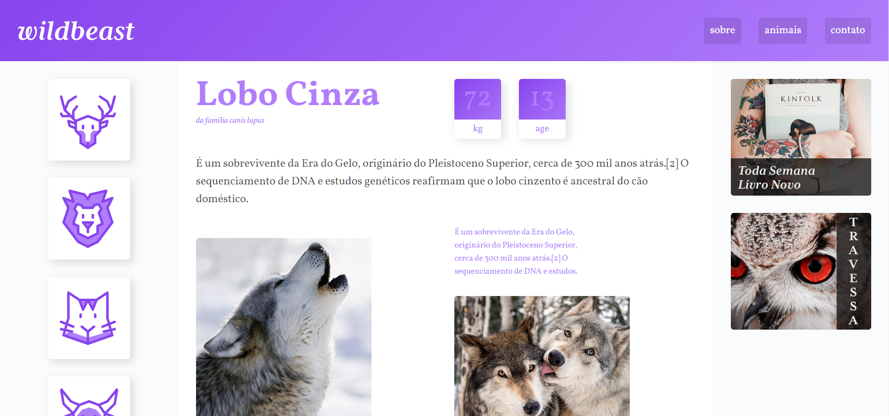

# Willdbeast ([Click Here](https://netinhoalves.github.io/Wildbeast/))

## SOBRE ESTE PROJETO!

Este é um desafio proposto pelo professor [André Rafael](https://www.youtube.com/origamid) no final do curso "CSS Grid Layout", onde aprendi muito sobre esta técnica e consegui implementá-la, não só neste desafio, mas como em meus projetos pessoais. Este desafio é resultado de tudo que aprendi em aula.

## Tecnologias usadas

* HTML5
* CSS3
* FlexBox
* CSS Grid Layout
* Media-queries
* Responsive Website

## Acessar minha resolução

   Eu hospedei este desafio com a ajuda do GitHub Pages, para acessar minha resolução deste desafio [Clique Aqui](https://netinhoalves.github.io/Wildbeast/)
